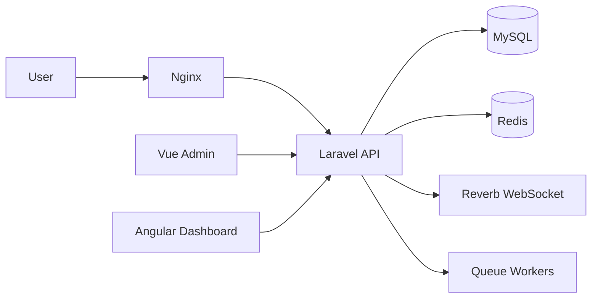

# Architecture

## Purpose

This project is the Multi-Tenant Telephony Platform foundation focused on architecture quality and delivery discipline:

- API-first Laravel backend (`/api/v1`) as the system core
- Vue Admin (inside backend) + Angular Dashboard as separated frontend clients
- Modular monolith implementation with explicit service boundaries
- Future microservices preparation documented without runtime extraction

The goal of this document is to be the central architecture map and entry point to deeper technical documentation.

## Architectural Style

Primary architecture decisions:

- API-first application design and versioned route surface
- Modular monolith as current runtime strategy
- Service-oriented internal module boundaries
- Event-driven foundations for async side effects
- Docker-first local development and reproducible environment
- Security, performance, and observability treated as first-class architecture concerns

## System Context

Core runtime components:

- Laravel backend/API (business logic, RBAC, auth, docs access control)
- Vue Admin (internal operations UI)
- Angular Dashboard (client-facing dashboard UI)
- MySQL (primary relational storage)
- Redis (cache, queue, realtime support)
- Reverb/WebSocket transport
- Queue workers (async processing)
- Nginx (HTTP edge in local/dev compose)
- Scramble/OpenAPI docs surface

## Runtime Building Blocks

### Backend Core

- Laravel 13, PHP 8.3
- API resources/response envelope conventions
- Session + bearer auth paths with RBAC enforcement
- Domain services under `app/Services/*`

### Frontend Clients

- Vue Admin via Vite (inside backend workspace)
- Angular Dashboard in separate frontend workspace/container
- Shared API contract and permission-aware behavior across both clients

### Data and Async Infrastructure

- MySQL for domain persistence
- Redis for cache and queue workloads
- Queue workers/supervisor strategy for retries and background processing
- Reverb for private/presence realtime channels

### API Documentation Surface

- Scramble-generated OpenAPI spec
- Permission-aware docs portal and filtered spec endpoints
- Full/raw docs access policy for full-access docs users

## Cross-Cutting Architecture Foundations

### Security Foundation

- Rate limiting policies by endpoint risk profile
- Secure headers baseline and CSP/HSTS policy controls
- Validation hardening and safe error envelopes
- Token security and realtime channel authorization hardening

See: `backend/docs/security.md`

### Performance Foundation

- Redis caching for stable/expensive read models
- Query optimization for chat and API hotspots
- Asset optimization for Vue/Angular builds
- Queue performance tuning and worker strategy

See: `backend/docs/performance.md`

### Monitoring and Logging Foundation

- Structured logging with sensitive-field stripping
- Queue and realtime logging policies
- Public liveness + protected readiness checks
- Container log strategy for Docker environments

See: `backend/docs/monitoring.md`

## Documentation Map

This file is the architecture hub. Use these documents for deep dives:

- Architecture details (this file): `backend/docs/architecture.md`
- Microservices preparation strategy: `backend/docs/microservices.md`
- API/OpenAPI strategy: `backend/docs/api/openapi-preparation.md`, `backend/docs/api/openapi-generator.md`
- Security foundations: `backend/docs/security.md`
- Performance foundations: `backend/docs/performance.md`
- Monitoring/logging foundations: `backend/docs/monitoring.md`
- Command cookbook: `backend/docs/commands.md`
- Realtime guide: `backend/docs/realtime.md`
- Docker and runtime operations: `backend/docs/docker.md`
- Deployment configuration guidance: `backend/docs/deployment.md`
- CI/CD and release workflow: `backend/docs/ci-cd.md`, `backend/docs/release.md`

## Current Architecture Position

- Current implementation strategy is modular monolith.
- Microservices are documented as a future strategy only.
- Runtime extraction is intentionally deferred until contract, observability, and operational gates are met.

## Internal Module Contracts

This modular monolith keeps domain boundaries explicit without extracting services.

Contract policy:

- Module public APIs are service-first (not controller-to-controller).
- Cross-module communication should prefer events and explicit service contracts.
- No direct frontend-specific logic inside domain services.
- No microservice extraction in this phase.

### Auth / Identity Module

- Responsibility: session/token authentication, current user identity, auth guards.
- Public services/contracts: `AuthController` API contract, Sanctum token/session flows.
- Consumed events: user lifecycle updates affecting auth context.
- Emitted events: auth/token lifecycle events.
- Allowed dependencies: Users/RBAC, Monitoring, Security policy config.
- Forbidden dependencies: Chat internals, controller-to-controller calls.
- Data ownership: auth sessions, personal access token lifecycle.
- Extraction readiness notes: boundary is stable; externalization should keep `/api/v1/auth/*` contract unchanged.

### Users / RBAC Module

- Responsibility: users, roles, permissions, effective permissions cache.
- Public services/contracts: `PermissionCacheService`, `RbacMaintenanceService`, user/role/permission APIs.
- Consumed events: user/role/permission change events.
- Emitted events: role/permission/user authorization-related events.
- Allowed dependencies: Auth identity lookup, Activity logging, Notifications integration.
- Forbidden dependencies: direct writes into Chat-owned aggregates.
- Data ownership: users, roles, permissions, mapping/pivot authorization data.
- Extraction readiness notes: maintain permission middleware and cache invalidation boundary as contract surface.

### Dashboard / Stats Module

- Responsibility: dashboard counters and aggregated stats endpoints.
- Public services/contracts: stats API endpoints and response envelope contracts.
- Consumed events: activity/notifications/chat events for aggregate updates.
- Emitted events: none required for current foundation.
- Allowed dependencies: Activity, Notifications, Chat read-only aggregate queries.
- Forbidden dependencies: mutation of foreign module data.
- Data ownership: aggregate/query projection data only.
- Extraction readiness notes: keep query-only boundary and avoid ownership leakage.

### Activity Module

- Responsibility: audit/activity timeline and integration events.
- Public services/contracts: activity API endpoint contracts and event handlers.
- Consumed events: auth/user/rbac/chat/notification lifecycle events.
- Emitted events: activity stream notifications where configured.
- Allowed dependencies: all domain events as inputs.
- Forbidden dependencies: direct business mutation in source modules.
- Data ownership: activity log records.
- Extraction readiness notes: event-consumer boundary already aligned for future extraction.

### Notifications Module

- Responsibility: notification CRUD/read state/preferences and unread counters.
- Public services/contracts: notification endpoints and preference update contracts.
- Consumed events: auth/user/chat/activity events that trigger notifications.
- Emitted events: notification lifecycle events/realtime notifications.
- Allowed dependencies: Auth identity, Realtime broadcast abstraction, Activity integration.
- Forbidden dependencies: direct mutation of Chat core entities.
- Data ownership: notifications and user notification preferences.
- Extraction readiness notes: keep notifier API and event contracts stable.

### Chat Module

- Responsibility: conversations, messages, participants, attachments, read/delivery states.
- Public services/contracts:
  - `ChatConversationService`
  - `ChatMessageService`
  - `ChatReadStateService`
  - `ChatWebhookDeliveryService`
  - `ChatAttachmentService`
  - `ChatPresenceService`
- Consumed events: identity/permission lookups, notification/activity integration triggers.
- Emitted events: chat conversation/message/participant/attachment/realtime/webhook-related events.
- Allowed dependencies: Users/RBAC checks, Notifications dispatch, Activity integration, Realtime broadcast.
- Forbidden dependencies: controller-to-controller orchestration, frontend rendering logic, raw cross-module DB writes outside service boundary.
- Data ownership: chat conversations/messages/participants/attachments/read/delivery/webhook endpoint metadata.
- Extraction readiness notes: service surface is explicit; keep cross-module calls through contracts/events.

### Webhooks / External API Module

- Responsibility: webhook endpoint management, webhook delivery status, external message ingestion.
- Public services/contracts:
  - `ChatWebhookSigningService`
  - `ChatWebhookReplayProtectionService`
  - `ExternalChatMessageService`
  - `ExternalChatTokenService`
- Consumed events: chat lifecycle events for outgoing webhook delivery.
- Emitted events: webhook delivery lifecycle updates and callback events.
- Allowed dependencies: Chat public services, Security rate-limit/signature policy, Queue jobs.
- Forbidden dependencies: exposing token hashes/secrets across module boundaries.
- Data ownership: webhook endpoints/deliveries, external message mapping metadata.
- Extraction readiness notes: signature/replay/token scope contracts are primary extraction boundary.

### Realtime Module

- Responsibility: channel authorization and realtime broadcast signaling.
- Public services/contracts: broadcast channel policy in `routes/channels.php`, realtime service layer, realtime jobs.
- Consumed events: chat/notification/activity events.
- Emitted events: private/presence channel broadcasts.
- Allowed dependencies: Auth identity, Chat access policy, Notification events.
- Forbidden dependencies: leaking sensitive payload fields in presence/realtime events.
- Data ownership: realtime presence state/protocol-level signaling only.
- Extraction readiness notes: keep channel auth and payload safety contract stable before transport changes.

### Monitoring Module

- Responsibility: liveness/readiness checks and safe operational status.
- Public services/contracts: `MonitoringHealthService`, `/health`, protected monitoring endpoint.
- Consumed events: none mandatory; reads infra dependency status.
- Emitted events: structured monitoring/error logs.
- Allowed dependencies: database/cache/queue/redis health probes.
- Forbidden dependencies: exposing secrets/env/raw traces.
- Data ownership: monitoring check summaries only.
- Extraction readiness notes: health contract can be externalized behind same endpoint semantics.

### API Docs Module

- Responsibility: OpenAPI generation, docs access control, permission-aware portal/filtering.
- Public services/contracts:
  - `ApiDocsPermissionService`
  - `ApiDocsOpenApiFilterService`
  - docs access middleware/gates
- Consumed events: RBAC permission changes (for docs visibility semantics).
- Emitted events: none mandatory (read-oriented module).
- Allowed dependencies: RBAC permission checks, monitoring-safe logging.
- Forbidden dependencies: bypassing docs permission model or exposing raw docs to limited users.
- Data ownership: docs permission map/config and filtered docs view logic.
- Extraction readiness notes: keep `/docs/api*` access policy and filtering rules as stable contract.

### Settings / Translations Module

- Responsibility: runtime settings and translation management/preload.
- Public services/contracts:
  - `SettingsService`
  - `TranslationService`
  - `Localization` runtime preload endpoints
- Consumed events: user/role changes that affect effective settings visibility.
- Emitted events: settings/translation update events where applicable.
- Allowed dependencies: Auth/RBAC guards, cache invalidation services.
- Forbidden dependencies: direct mutation of unrelated module owned data.
- Data ownership: system settings and translation records.
- Extraction readiness notes: keep settings/translation API shape and preload contracts stable.

## Event-Driven Module Communication

This modular monolith uses event-driven communication to reduce coupling without extracting services.

### Event taxonomy

1. Domain Events
   - Internal Laravel/PHP events for module decoupling.
   - Should carry IDs and safe metadata rather than full payload blobs.
   - Examples in current codebase: `ActivityLogged`, `PermissionChanged`, `RolePermissionsChanged`, `ChatMessageCreated`.

2. Queue Jobs
   - Async side effects and integration work.
   - Must use retry/backoff/failure handling and keep idempotency where relevant.
   - Must not mutate HTTP response contracts directly.
   - Examples: `DeliverChatWebhookJob`, `CreateNotificationJob`, realtime broadcast jobs.

3. Broadcast Events
   - Realtime UI synchronization events over private/presence channels.
   - Channel authorization is required.
   - Payloads must be safe/minimal and aligned with realtime payload policy.

4. Webhook Events
   - External delivery contract events for integrations.
   - Must respect signature, replay protection, rate limits, and safe payload policy.
   - Event names should remain versionable and contract-stable.

5. Activity/Audit Events
   - High-signal timeline events for observability and audit.
   - Should include safe metadata only (no secrets/raw payloads).

### Allowed communication paths

- Controller -> Service in the same module boundary.
- Service -> Domain Event dispatch.
- Event listener / queue job -> public contract/service of another module.
- Module -> queue job for async side effects.
- Module -> another module public contract/service (explicit boundary calls).

### Avoid / forbidden communication paths

- Controller -> controller calls.
- Module -> another module private service bypassing boundary contracts.
- Raw DB writes into another module-owned tables.
- Broadcast/webhook events with raw domain payload dumps.
- Passing full Eloquent models across boundaries where IDs are sufficient.
- Heavy sync side effects inside read/list APIs.

### Event naming rules

- Use `module.entity.action` naming where possible.
- Examples:
  - `chat.message.created`
  - `chat.participant.blocked`
  - `notification.created`
  - `activity.logged`

### Payload safety rules

- Prefer IDs over full models.
- Use safe scalar metadata and contracted fields only.
- Never include:
  - token/authorization/cookie
  - secret/signature/webhook_secret
  - raw_payload/raw_response
  - file `disk`/`path`/`checksum`
  - `device_key`/`user_agent`/`ip_address` unless explicitly justified
- Keep webhook/external payloads versionable and backward-compatible.

### Modular monolith note

This is a modular monolith foundation. Event contracts are prepared for future extraction readiness, but no microservice split is performed in this phase.

## Service Boundaries

This section defines service boundary rules for the modular monolith without mass refactoring or premature interface extraction.

### Public Module Services

These are contract-like services that other modules may call directly.

- Chat:
  - `ChatConversationService`
  - `ChatMessageService`
  - `ChatReadStateService`
  - `ChatAttachmentService`
- Activity:
  - `ActivityService`
- Notifications:
  - `NotificationService`
  - `NotificationPreferenceService`
- RBAC / Access:
  - `PermissionService`
  - `RoleService`
  - `UserService`
  - `ApiDocsPermissionService`
- Monitoring / System:
  - `MonitoringHealthService`
  - `SystemHealthService`
- API Docs:
  - `ApiDocsOpenApiFilterService`

### Internal Module Services

These services are internal by default and should not be called directly across module boundaries.

- Query services (for example `ChatConversationQueryService`, `SettingsQueryService`)
- Cache services (for example `MetaCacheService`, `PermissionCacheService`, `SettingsCacheService`, `TranslationCacheService`)
- Payload builders and formatters (for example `TranslationPayloadBuilder`, `TranslationFormatterService`)
- Sanitizers and safety helpers (for example `StructuredLogContextService`)
- Realtime helpers and delivery internals (for example `ChatPresenceService`, `ChatWebhookSigningService`, `ChatWebhookReplayProtectionService`)

### Infrastructure Services

Infrastructure services provide platform capabilities and cross-cutting support.

- Logging and monitoring (`RealtimeLogService`, `StructuredLogContextService`, monitoring health checks)
- Cache and queue integration services
- API docs access/filter helpers
- Translation/settings resolver helpers used as platform support

### Allowed call patterns

- Controller -> public module service.
- Public module service -> internal service within the same module.
- Listener/job -> public module service.
- Module -> another module public service/contract.
- Cross-module side effects through events/jobs where practical.

### Avoid / forbidden call patterns

- Controller -> internal helper service of another module.
- Controller -> controller calls.
- Service -> HTTP controller.
- Service -> raw HTTP request object outside the HTTP boundary.
- Cross-module raw DB writes into another module-owned tables.
- Passing full Eloquent models across module boundaries when ID/DTO is enough.

### Naming/marker convention

- `*QueryService`, `*CacheService`, `*PayloadBuilder`, `*Sanitizer`, `*Mapper` are internal by default.
- `*Service` can be public only if explicitly listed in this architecture document.
- Contracts/interfaces are optional and added only for clear extraction readiness; no mass interface extraction in this phase.

## Future Extraction Strategy

This project remains a modular monolith by default. Extraction is a future option only when clear operational and product signals justify it.

### Extraction readiness levels

- Level 0: internal module only (no explicit cross-module boundary).
- Level 1: documented boundary (responsibility and ownership written in architecture docs).
- Level 2: public contract/service boundary (stable service-first integration points).
- Level 3: async/event contract ready (event taxonomy, retry policy, payload safety validated).
- Level 4: independently deployable candidate (clear ownership, observability, and release/rollback path).

Current strategy: move modules incrementally from Level 1/2 toward Level 3 before considering Level 4 extraction.

### Candidate domains

#### Notifications candidate

- Extraction priority: medium/high.
- Why extract: async workload, delivery fan-out, independent scale profile.
- Current ownership: notifications + preferences in Notifications module.
- Current boundaries: `NotificationService`, `NotificationPreferenceService`, notification events/jobs, private realtime channels.
- Required contracts before extraction: stable notification API/event contract, delivery status contract, retry/backoff contract.
- Required data ownership changes: isolate notification tables and preference ownership lifecycle.
- Communication style after extraction: async events/jobs first, minimal sync calls for critical reads only.
- Risks: coupling with user preferences, realtime coupling, duplicate delivery semantics.
- Not-now reason: current modular monolith capacity is sufficient and operational overhead would increase too early.
- Readiness level: Level 3 candidate.

#### Realtime/WebSocket candidate

- Extraction priority: medium.
- Why extract: independent scaling and operational tuning for websocket traffic.
- Current ownership: channel authorization + broadcast dispatch + presence payload policy.
- Current boundaries: `routes/channels.php`, realtime jobs/events, `RealtimeLogService`.
- Required contracts before extraction: channel auth contract, safe presence payload contract, broadcast event versioning policy.
- Required data ownership changes: keep presence protocol state isolated from business aggregates.
- Communication style after extraction: event-driven broadcast pipeline from domain modules.
- Risks: auth coupling, presence consistency, increased troubleshooting complexity.
- Not-now reason: current in-process realtime path is stable and simpler to operate.
- Readiness level: Level 2/3 candidate.

#### External Webhooks candidate

- Extraction priority: medium/high.
- Why extract: integration-heavy traffic, retries/replay/hmac concerns, independent failure domain.
- Current ownership: webhook endpoints/deliveries and external callbacks.
- Current boundaries: `ChatWebhookDeliveryService`, `ChatWebhookSigningService`, `ChatWebhookReplayProtectionService`, webhook jobs/events.
- Required contracts before extraction: signed webhook contract, idempotency contract, delivery status/retry contract.
- Required data ownership changes: webhook endpoints and delivery records managed as dedicated ownership boundary.
- Communication style after extraction: async event delivery with hardened callback API.
- Risks: token/scope lifecycle coupling, delivery idempotency regressions.
- Not-now reason: current queue-based monolith integration already covers target reliability for present load.
- Readiness level: Level 3 candidate.

#### Activity/Audit candidate

- Extraction priority: medium.
- Why extract: append-only/event-consumer pattern is naturally decoupled.
- Current ownership: activity timeline records and safe audit metadata.
- Current boundaries: `ActivityService`, domain events consumed via listeners/jobs, realtime activity stream bridge.
- Required contracts before extraction: canonical activity event schema, retention/archive contract.
- Required data ownership changes: separate activity storage lifecycle and retention policy.
- Communication style after extraction: event ingestion pipeline from internal domain events.
- Risks: schema drift across emitters, ordering guarantees.
- Not-now reason: local queries and event consumers are lightweight inside monolith.
- Readiness level: Level 3 candidate.

#### Auth/Identity candidate

- Extraction priority: low/medium.
- Why extract: centralized identity can scale independently in larger ecosystems.
- Current ownership: session/token flows, current-user identity, auth guards.
- Current boundaries: `/api/v1/auth/*` contract, Sanctum/session guard strategy.
- Required contracts before extraction: stable identity API, token introspection/session validation contract.
- Required data ownership changes: clear user identity ownership and credential/token lifecycle domain split.
- Communication style after extraction: explicit auth API/token introspection, minimal trusted sync calls.
- Risks: highest blast radius, migration complexity, auth latency and failure propagation.
- Not-now reason: strongest coupling to core app flows; current monolith model is safer.
- Readiness level: Level 2 candidate.

#### API Docs/Monitoring candidate

- Extraction priority: low.
- Why extract: operational tooling can be separated in larger organizations.
- Current ownership: docs access/filtering and health/readiness checks.
- Current boundaries: `ApiDocsPermissionService`, `ApiDocsOpenApiFilterService`, `MonitoringHealthService`, health routes.
- Required contracts before extraction: stable docs policy contract, health response contract.
- Required data ownership changes: none major; mostly policy/observability boundary formalization.
- Communication style after extraction: read-only API contracts with strict safety controls.
- Risks: added complexity with low direct product value.
- Not-now reason: these modules are lightweight and tightly aligned with app runtime.
- Readiness level: Level 2 candidate.

#### Chat candidate (complex)

- Extraction priority: low now, potentially high later.
- Why extract: high-volume conversations/messages/realtime/webhook interactions may need independent scaling.
- Current ownership: conversations/messages/participants/attachments/read-state plus chat webhook integrations.
- Current boundaries: `ChatConversationService`, `ChatMessageService`, `ChatReadStateService`, chat event taxonomy, webhook and realtime contracts.
- Required contracts before extraction: strict message/conversation contract, participant authorization contract, webhook/realtime payload/version contract.
- Required data ownership changes: strongest split needed; chat aggregate ownership must be fully isolated.
- Communication style after extraction: event-first integration, minimal synchronous query bridge for essential UX surfaces.
- Risks: largest data consistency risk, permission coupling, delivery/read-state race conditions.
- Not-now reason: most complex domain; extraction before stronger operational need would increase risk.
- Readiness level: Level 2/3 candidate.

### Required contracts before extraction (global)

- Stable service-level public boundaries for each module.
- Event schema versioning and safe payload policy.
- Retry/backoff/idempotency rules for async effects.
- Health/readiness and structured logging per candidate module.
- Backward-compatible API contracts preserved at system edge.

### Data ownership changes before extraction (global)

- One module owns one data aggregate lifecycle.
- No cross-module direct DB writes.
- Explicit ownership for read models/projections.
- Migration and rollback plan per ownership split.

### Communication style after extraction (target)

- Prefer async event-driven integration for side effects.
- Keep synchronous calls minimal, explicit, and contract-validated.
- Avoid shared-database microservices and avoid direct cross-service DB writes.
- Avoid distributed transactions as default architecture.

### Not-now / anti-pattern rules

Do not do this in the current phase:

- Shared database microservices with hidden coupling.
- Direct cross-service DB writes.
- Distributed transactions as default integration strategy.
- Duplicated auth/permission logic in multiple extracted services.
- Internal network calls between modules still running inside the same monolith process.
- Kafka/RabbitMQ adoption before clear throughput and operational need.

### Modular monolith position

Current architecture remains modular monolith. Extraction is a future strategy and not an implementation goal in this phase.

Related document:

- `backend/docs/microservices.md` (extractable domains assessment and decision matrix for future phases)
