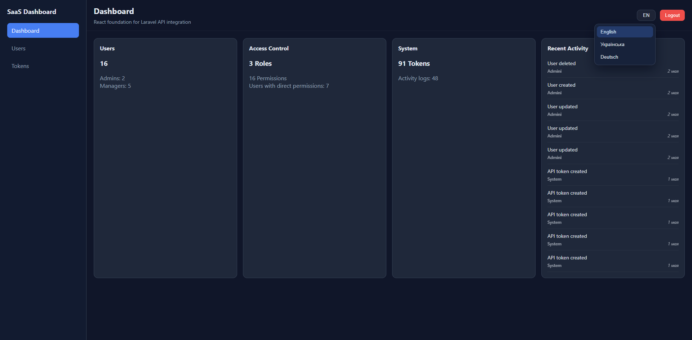
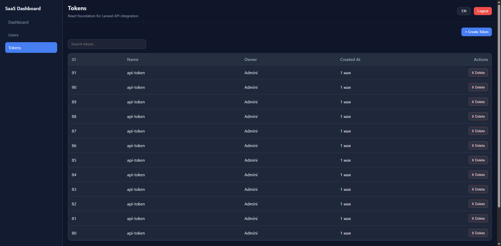
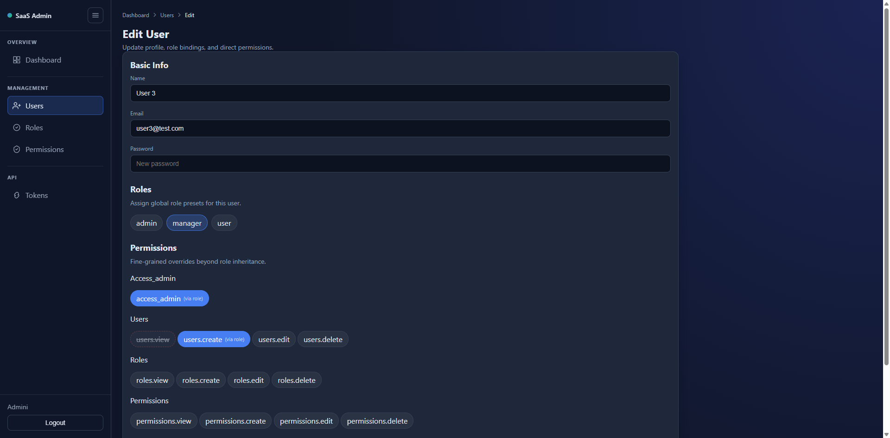
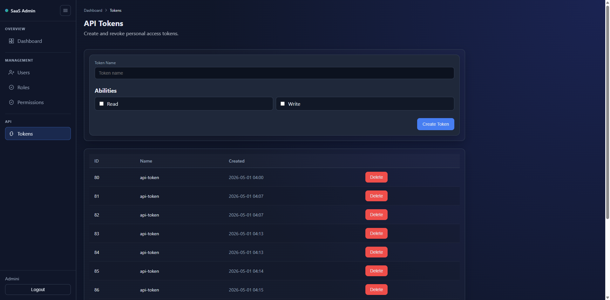

# Documentation

## Overview

This directory contains technical documentation for the project.

It covers system architecture, development workflow, and operational guidelines for both backend and frontend parts of the application.

The project follows an API-first, modular architecture with clear separation between services.

---

## Structure

- [architecture.md](./architecture.md) - System design, components, and data flow
- [architecture/README.md](./architecture/README.md) - Architecture hub for the approved target model and implementation planning
- [commands.md](./commands.md) - Development and operational commands
- [coding-standards.md](./coding-standards.md) - Code style and best practices
- [api.md](./api.md) - API endpoints and examples
- [TODO.md](../TODO.md) - Development roadmap and task tracking

---

## Quick Navigation

- Architecture -> [./architecture.md](./architecture.md)
- Architecture Pack -> [./architecture/README.md](./architecture/README.md)
- API -> [./api.md](./api.md)
- Commands -> [./commands.md](./commands.md)
- Coding Standards -> [./coding-standards.md](./coding-standards.md)
- TODO -> [../TODO.md](../TODO.md)

---

## Purpose

This documentation is designed to:

- Help developers quickly understand the system
- Provide consistent development guidelines
- Explain architectural decisions
- Simplify onboarding and collaboration

---

## Development Workflow

The project follows a structured, incremental workflow:

1. Review tasks in `TODO.md`
2. Implement features step-by-step
3. Use small, meaningful commits
4. Validate changes in Docker environment
5. Keep frontend and backend in sync

---

## Best Practices

- Keep code modular and maintainable
- Use environment variables for configuration
- Avoid hardcoded values
- Follow consistent naming conventions
- Document non-obvious decisions (WHY comments)

---

## System Notes

- All services run in Docker
- Backend (Laravel) handles API and admin panel
- Angular Dashboard is a separate SPA, while Vue Admin lives inside the backend workspace
- RBAC system controls access (roles + permissions + overrides)
- Token-based authentication via Sanctum

---

## Screenshots

Below are key UI screens demonstrating system functionality.

---

### Frontend (Angular Dashboard)

#### Dashboard
Shows system statistics and recent activity.

#### Users Management
User list with roles and permissions overview.

#### RBAC Permissions (User Edit)
Role-based and manual permissions with override support.

#### Tokens Management
API token list for secure access control.

#### Token Creation
Token is shown once after creation (secure UX).

---

### Backend (Blade Admin Panel)

#### Dashboard
Admin metrics and system overview.

#### Users Management
Full user management interface.

#### RBAC (Admin)
Roles and permissions assignment in admin panel.

#### Roles Management
Manage system roles with restrictions.

#### Permissions Management
Centralized permissions control.

#### Tokens Management
Admin-level token management.

---

## Future Documentation

Planned improvements:

- API specification (OpenAPI / Postman)
- Deployment guide
- Monitoring and logging setup
- Scaling strategy

---

## Summary

This documentation reflects a structured approach to building Multi-Tenant Telephony Platform as an extensible application foundation with clear separation of concerns and production-ready practices.

---

<!-- WHY:
Improves developer navigation and onboarding experience.
-->
## Related Documentation

- [Architecture](./architecture.md)
- [API](./api.md)
- [Commands](./commands.md)
- [Coding Standards](./coding-standards.md)
- [Main Docs](./README.md)
