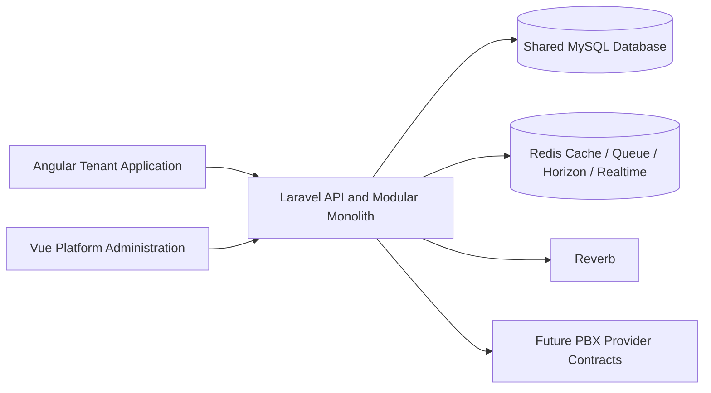

# Architecture Overview

This architecture pack documents the current runtime foundation and the next planned platform boundary work for `multi-tenant-telephony-platform`.

It is intentionally split into focused documents so we can keep the existing baseline stable while planning the next phase carefully.

## System Map

## Approved Architecture

- Laravel is the single backend API and business-logic runtime.
- Angular is the tenant-facing frontend.
- Vue is the platform administration frontend.
- MySQL is the shared database.
- Redis supports cache, queues, Horizon, and realtime infrastructure.
- Reverb provides application realtime transport.
- FreeSWITCH is a future external PBX/media provider, not part of the current baseline.
- Laravel will talk to PBX implementations through provider contracts.
- Shared-database multi-tenancy is the approved model for the next implementation phase.
- Roles are permission sets.
- Tenant isolation is a separate security boundary from permissions.

## Current Foundation

The current baseline already includes:

- Laravel API endpoints, authentication, RBAC, chat, notifications, realtime, queues, monitoring, and documentation.
- Angular tenant dashboard, chat client, auth flow, and realtime client.
- Vue administration dashboard, session auth flow, monitoring views, and admin diagnostics.
- Redis-backed queue processing and Reverb broadcasting.
- A stable Docker stack with MySQL, Redis, Nginx, backend, Angular, Vue, Horizon, queue worker, Reverb, and scheduler services.

This is the working foundation that will be extended, not replaced.

## Next Implementation Phase

The next planned backend capability is shared-database multi-tenancy.

The implementation plan documents:

- tenant and membership entities;
- tenant context resolution;
- tenant-owned data scoping;
- backend authorization and data-access rules;
- queue, broadcast, and job context propagation;
- tenant isolation tests.

See: [multi-tenancy-plan.md](./multi-tenancy-plan.md)

## Future Telephony Phases

Telephony work comes after tenant isolation is in place.

The future telephony path includes:

- provider contracts and adapters;
- FreeSWITCH integration behind Laravel abstractions;
- contacts, extensions, phone numbers, call logs, and routing;
- call-control layers in Angular;
- conference and recording workflows;
- billing, reporting, and monitoring expansion.

## Related Docs

- [System Context](./system-context.md)
- [Module Boundaries](./module-boundaries.md)
- [Request Flows](./request-flows.md)
- [Frontend Boundaries](./frontend-boundaries.md)
- [Extension Rules](./extension-rules.md)
- [Multi-Tenancy Plan](./multi-tenancy-plan.md)
- [Architecture Decision Records](../adr)
